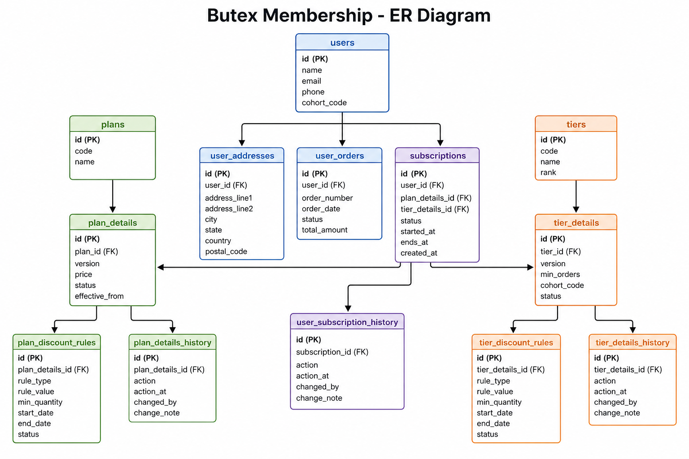

# Butex — FirstClub Membership Backend


A Spring Boot backend for FirstClub’s membership program. Users can pick a plan, choose a tier, subscribe, change tier, cancel, and track their membership.

Built as part of a backend task — repo name **butex** is intentional.

**Live demo:** https://butex-8fr2.onrender.com  
**Swagger UI:** https://butex-8fr2.onrender.com/swagger-ui/index.html  

*(Render free tier may sleep — first request can take ~50s to wake up.)*

---

## What we built

### Membership plans
- **Monthly**, **Quarterly**, and **Yearly** plans
- Each plan has its own price, duration, and benefits (discount %, free delivery, exclusive deals, etc.)
- Plans are versioned — so pricing can change over time without breaking old subscriptions

### Membership tiers
- **Silver**, **Gold**, and **Platinum** tiers
- Each tier has rank, perks, and eligibility rules (min orders, monthly spend, cohort)
- Users can **upgrade or downgrade** tier on an active subscription
- **Automated tier promotion** — a daily cron checks active subscriptions and upgrades users who qualify for a higher tier based on:
  - Total order count (≥ tier’s `minOrders`)
  - Monthly order spend (≥ tier’s `minMonthlyOrderValue`)
  - Cohort match (user’s `cohortCode` matches tier’s `cohortCode`, when set)

### Subscriptions
- Subscribe to a **plan + tier** together
- View **current** active membership (with start & expiry dates)
- View full **subscription history**
- **Cancel** an active subscription
- **Change tier** (upgrade / downgrade)
- **Renew** an active subscription (extends expiry by plan duration)
- **Change plan** (e.g. Monthly → Yearly)
- **Auto-expire** cron marks overdue active subscriptions as `EXPIRED`

### Users
- Create a user (name, email, phone)
- Fetch user by ID

### Checkout benefits
- **Checkout API** applies membership perks to a cart
- Merges plan + tier base discounts with item/category discount rules
- Returns free delivery, exclusive deals, early sale, priority support flags
- Per-line and total discount amounts for checkout

### Benefits & discounts (data model)
- Plan and tier benefits stored on each plan/tier version
- Separate **discount rule** tables for item/category-level discounts

### Audit trail
- **Plan details history** — when plan pricing/versions were created or changed
- **User subscription history** — subscribe, cancel, tier change, renew, expire events

### Other good stuff
- Clean layered structure: `controller → service → repository → entity`
- Consistent API wrapper (`status`, `message`, `data`)
- Global exception handling + request validation
- Tier eligibility enforced on subscribe and tier change
- Expiry checked consistently across current subscription, renew, checkout, and crons
- Partial DB unique index — one `ACTIVE` subscription per user
- Swagger UI for API exploration
- Integration tests for core membership flows
- **Redis distributed locks** on scheduled cron jobs (multi-instance safe)
- PostgreSQL on **Neon** for cloud DB (local profile for dev, prod profile for hosting)

---

## Tech stack

- Java 17
- Spring Boot 4
- Spring Data JPA
- PostgreSQL (Neon)
- Redis (distributed locking + response cache)
- Lombok
- Maven

---

Full API docs with request/response examples: **[docs/API.md](docs/API.md)**

## Try the hosted API

Base URL: **https://butex-8fr2.onrender.com**

Quick smoke test (no setup needed):

```bash
# List plans
curl https://butex-8fr2.onrender.com/api/v1/membership/plans

# List tiers
curl https://butex-8fr2.onrender.com/api/v1/membership/tiers

# Create a user
curl -X POST https://butex-8fr2.onrender.com/api/v1/users \
  -H "Content-Type: application/json" \
  -d '{"name": "Test User", "email": "test@example.com", "phone": "9876543210"}'
```

Use the returned `userId` plus `planDetailsId` / `tierDetailsId` from `/plans` and `/tiers` for subscribe and other flows. Interactive testing: **[Swagger UI](https://butex-8fr2.onrender.com/swagger-ui/index.html)**.

## API endpoints

| Method | Endpoint | What it does |
|--------|----------|--------------|
| `GET` | `/api/v1/membership/plans` | List active plans with pricing & benefits |
| `GET` | `/api/v1/membership/tiers` | List active tiers with perks & criteria |
| `POST` | `/api/v1/users` | Create a user |
| `GET` | `/api/v1/users/{userId}` | Get user details |
| `POST` | `/api/v1/users/{userId}/subscriptions` | Subscribe to a plan + tier |
| `GET` | `/api/v1/users/{userId}/subscriptions/current` | Get active subscription |
| `GET` | `/api/v1/users/{userId}/subscriptions` | Get subscription history |
| `POST` | `/api/v1/users/{userId}/subscriptions/cancel` | Cancel active subscription |
| `PUT` | `/api/v1/users/{userId}/subscriptions/tier` | Upgrade / downgrade tier |
| `POST` | `/api/v1/users/{userId}/subscriptions/renew` | Renew active subscription |
| `PUT` | `/api/v1/users/{userId}/subscriptions/plan` | Change membership plan |
| `POST` | `/api/v1/users/{userId}/checkout/benefits` | Apply membership benefits to cart |

### Example: subscribe

**Hosted:**

```bash
curl -X POST https://butex-8fr2.onrender.com/api/v1/users/1/subscriptions \
  -H "Content-Type: application/json" \
  -d '{"planDetailsId": 1, "tierDetailsId": 1}'
```

**Local:**

```bash
curl -X POST http://localhost:8080/api/v1/users/1/subscriptions \
  -H "Content-Type: application/json" \
  -d '{"planDetailsId": 1, "tierDetailsId": 1}'
```

Get `planDetailsId` and `tierDetailsId` from the `/plans` and `/tiers` responses first.

### Example: checkout benefits

**Hosted:**

```bash
curl -X POST https://butex-8fr2.onrender.com/api/v1/users/1/checkout/benefits \
  -H "Content-Type: application/json" \
  -d '{
    "items": [
      {"itemId": "SKU-DAIRY-001", "categoryId": "GROCERIES", "lineTotal": 500},
      {"itemId": "SKU-PHONE-200", "categoryId": "ELECTRONICS", "lineTotal": 15000}
    ]
  }'
```

**Local:**

```bash
curl -X POST http://localhost:8080/api/v1/users/1/checkout/benefits \
  -H "Content-Type: application/json" \
  -d '{
    "items": [
      {"itemId": "SKU-DAIRY-001", "categoryId": "GROCERIES", "lineTotal": 500},
      {"itemId": "SKU-PHONE-200", "categoryId": "ELECTRONICS", "lineTotal": 15000}
    ]
  }'
```

---

## Run locally

**Prerequisites:** Java 17+, Maven (or use `./mvnw`)

1. Create `src/main/resources/application-local.properties` (this file is gitignored):

```properties
spring.datasource.url=jdbc:postgresql://<your-neon-host>/neondb?sslmode=require
spring.datasource.username=<username>
spring.datasource.password=<password>
spring.datasource.driver-class-name=org.postgresql.Driver

# optional — defaults to Render Redis if omitted
spring.data.redis.url=redis://red-d2tub8buibrs73f57f1g:6379
```

2. Start the app:

```bash
./mvnw spring-boot:run -Dspring-boot.run.profiles=local
```

App runs at **http://localhost:8080**

**API docs:** http://localhost:8080/swagger-ui/index.html

---

## Database

### ER diagram



Source DBML (editable): [`docs/DATABASE.dbml`](docs/DATABASE.dbml) — paste into [dbdiagram.io](https://dbdiagram.io) to tweak or re-export. **Schema source of truth is `DATABASE.dbml` + JPA entities** (the PNG above is illustrative; e.g. `user_orders` in code has `order_value`, `ordered_at` — not `order_number` / `status` shown in some diagram exports).

12 tables, including:

- `users`, `user_addresses`
- `plans`, `plan_details`, `plan_discount_rules`, `plan_details_history`
- `tiers`, `tier_details`, `tier_discount_rules`, `tier_details_history`
- `subscriptions`, `user_subscription_history`
- `user_orders` (drives tier promotion checks)

---

## Scheduled jobs

**Subscription expiry** — **1:00 AM** daily (`Constants.SUBSCRIPTION_EXPIRY_CRON`)

**Tier promotion** — **2:00 AM** daily (`Constants.TIER_PROMOTION_CRON`)

Both jobs are always enabled. Change schedules in `Constants.java`.

Each cron uses `LockService.runWithLock(...)` so only one instance runs per minute window when multiple replicas are deployed.

Tier promotion reads order data from `user_orders`. Users can have an optional `cohort_code` for cohort-based tiers.

---

## Redis & concurrency

**Redis URL (default):** `redis://red-d2tub8buibrs73f57f1g:6379`

Override with env var `REDIS_URL` in prod or add to `application-local.properties` for local dev.

### Distributed locks (cron jobs only)

| Lock key pattern | Used for |
|------------------|----------|
| `subscription-expiry-cron:{minute}` | Daily expiry job |
| `tier-promotion-cron:{minute}` | Daily tier promotion job |

`RedisLockService` mirrors the memcached `add` / `delete` pattern: `SET NX` with 120s TTL to acquire, `delete` to release. Integration tests use in-memory locks (`butex.lock.provider=in-memory`). `GET /api/v1/membership/plans` is cached for **10s** (`@Cacheable`).

---

## Project structure

```
src/main/java/com/example/butex/
├── controller/     # REST APIs
├── scheduler/      # SchedulerService — all cron jobs
├── service/        # Business logic
├── repository/     # DB access
├── entity/         # JPA models
├── dto/            # Request & response objects
├── exception/      # Error handling
└── enums/          # Status types, actions, etc.
```
